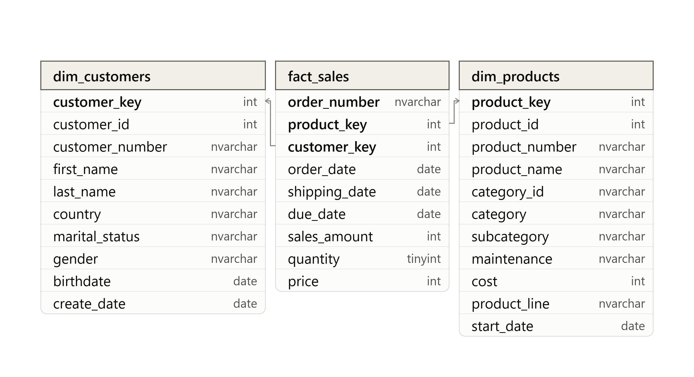

# Exploratory Data Analysis (EDA) — Retail Sales

This is the first project in a three-part series.

- **Exploratory Data Analysis (EDA)** ← you are here
- [Sales Funnel Analysis](#) — trend, segmentation, and BI visualization
- [Full Stack Analytics Project](#) — consolidated reporting, Databricks, and end-to-end storytelling

I've been working on some projects thinking I'd publish them all completed and sorted out, but I've come to the realization that it will never be perfect — so I've decided to think about it differently: I'll publish the imperfect queries, vizzes, and the overall project as they are. Over the coming days I'll be updating and integrating new technologies into this project, which I'm currently working on. Said that, let me present the project goal.

---

## Context

The context here is simple: Find data insights from a retail business selling across multiple product categories and presenting them to non-technical stakeholders.

## What This Project Answers

1. What does the data actually look like?
2. What's in the data — which countries, categories, and products are we working with?
3. What time period does this data cover?
4. What are the big numbers?
5. Where is the business concentrated — which categories, countries, or customers drive the most volume?
6. Who are the top and bottom performers?

## How This Project Answers It

**Phase 1 — Understand the Data**
Before drawing any conclusions, what tables exist? what they contain? and what time range the data covers?

📄 [`01_database_exploration.sql`](scripts/01_database_exploration.sql)
📄 [`02_dimensions_exploration.sql`](scripts/02_dimensions_exploration.sql)
📄 [`03_date_range_exploration.sql`](scripts/03_date_range_exploration.sql)

Schema Diagram:

**Phase 2 — Analysis**
With the shape of the data clear, where the business is concentrated? who or what is driving the most revenue? and least?
📄 [`04_measures_exploration.sql`](scripts/04_measures_exploration.sql)
📄 [`05_magnitude_analysis.sql`](scripts/05_magnitude_analysis.sql)
📄 [`06_ranking_analysis.sql`](scripts/06_ranking_analysis.sql)
📄 [`07_change_over_time_analysis.sql`](scripts/07_change_over_time_analysis.sql)
📄 [`08_cumulative_analysis.sql`](scripts/08_cumulative_analysis.sql)
📄 [`09_performance_analysis.sql`](scripts/09_performance_analysis.sql)
📄 [`10_data_segmentation.sql`](scripts/10_data_segmentation.sql)

**Phase 3 — Reports**
The big numbers — the ones a stakeholder would actually want to see first: total sales, total orders, total customers, average price.

📄 [`11_report_customers.sql`](scripts/11_report_customers.sql)
📄 [`12_report_products.sql`](scripts/12_report_products.sql)

## KPIs

The headline numbers this project surfaces:

- Total Sales
- Total Quantity Sold
- Average Selling Price
- Total Orders
- Total Products
- Total Customers

*(valores reales pendientes de ejecutar las queries — los añado en cuanto los tenga)*

## Next Steps

This EDA sets the groundwork for [**Sales Funnel Analysis**](#), where these same metrics get extended into trend analysis, customer segmentation, and interactive dashboards in Tableau and Power BI.
